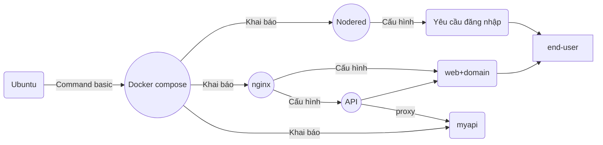

# Môn: Phát triển ứng dụng với mã nguồn mở-TEE0421

Lớp: 58KTPM

**Bài tập 01:** 

## deadline : 23h59 ngày 13 tháng 4 năm 2026.

### A. Đăng ký tên miền xịn cho cá nhân:
1. Đăng ký domain xịn (có thể dùng của [mắt bão](https://www.matbao.net/ten-mien/dang-ky-ten-mien.html), tên miền *.id.vn đang miễn phí cho mọi công dân việt nam <= 23 tuổi, *.io.vn : giá 30k vnđ/năm)
2. Đăng ký tài khoản [cloudflare](https://dash.cloudflare.com/)
3. Thêm domain đã đăng ký vào trong cloudflare : Nhận 2 dòng namespace
4. Nhập 2 dòng namespace của cloudflare vào trong trang quản lý DNS record của tên miền đăng ký (vd trên mắt bão)

### B. Cài đặt Ubuntu + Docker 
1. Cài đặt hệ điều hành Ubuntu 24.04.4 LTS
   - Sử dụng một trong các công cụ để giả lập: HyperV (có sẵn của windows), VirutualBox (Miễn phí), VM_Ware (bản quyền)
   - Download file [iso](https://releases.ubuntu.com/24.04.4/ubuntu-24.04.4-live-server-amd64.iso) để cài đặt.
   - Cấu hình mạng trong Ubuntu (và công cụ giả lập) để cho phép truy cập SSH vào Ubuntu từ cmd của windows   
   >    **Ví dụ:**
   >
   >    - để ssh tới ubuntu ở ip 192.168.100.123, user là admin thì mở CMD trên windows, 
   >    - gõ lệnh: **ssh admin@192.168.100.123** 
   >    - hệ thống sẽ yêu cầu nhập password (chú ý : password sẽ không hiện ra)
   >    - sau khi login thành công sẽ thấy màn hình chào hỏi của ubuntu
2. Tìm hiểu các lệnh cơ bản của ubuntu
   > *Các lệnh cần tìm hiểu:*
   > 
   >    - Liệt kê các file trong thư mục: ls
   >    - Tạo thư mục: mkdir nameFolder
   >    - Chuyển thư mục làm việc: cd path
   >    - Copy file: cp file_nguồn path/file_đích
   >    - Thay đổi quyền thao tác file: sudo chmod  xxx filename
   >    - Edit file: sudo nano tenfile
   >       + CTRL+o : lưu nội dung sau khi edit
   >       + CTRL+x : thoát edit file
   >    - Xem ip của máy ubuntu: ip -4 addr
   > 
3. Cài đặt docker cho Ubuntu
4. Kiểm tra phiên bản docker vừa cài đặt, kiểm tra phiên bản của docker compose
5. Cấu hình để docker chạy mà không cần tiền tố sudo
6. Tìm hiểu tập lệnh của docker và docker compose

### C. Cấu hình docker compose:
1. Tạo thư mục: ~/myapp
2. Chuyển vào trong thư mục ~/myapp
3. Tạo thư mục: ./myweb
4. Tạo file ./myweb/index.html (với nội dung là thông tin cá nhân của em)
5. Tạo file **docker-compose.yml** để nó sẽ có các dịch vụ sau:
   > - Khai báo sử dụng nodered/node-red, cổng 1880, dữ liệu nằm tại thư mục ./nodered
   > - Khai báo sử dụng nginx, cổng 80, cấu hình trong file ./nginx/nginx.conf
   > - Mount thư mục ./myweb thành thư mục /myweb trong nginx
   > - **Lưu ý** tất cả các dịch vụ (Nginx, Node-RED, Cloudflare Tunnel) phải nằm chung một network trong Docker Compose để có thể gọi nhau bằng tên service.
6. Edit file **./nginx/nginx.conf** để: 
   > - Cấu hình web server cổng 80
   > - server_name là sub-domain (sub-domain tuỳ ý của em)
   > - location / trỏ tới root là thư mục /myweb
   > - location /api dùng proxy_pass trỏ tới 1 (hoặc nhiều) node http_in của nodered
7. Edit file **./nodered/settings.js** để nodered bắt buộc đăng nhập

### D. (Bonus - không bắt buộc)
1. tạo thư mục ./myapi
2. tạo file ./myapi/app.py sử dụng Python + Flask để làm gì đó funny
3. tạo file ./myapi/requirements.txt chứa các thư viện mà app.py sử dụng (ví dụ: flask)
4. tạo file ./myapi/Dockerfile để khai báo sử dụng Python 3.9 slim
   ```
	# Sử dụng phiên bản Python nhẹ (alpine) để giảm dung lượng image
	FROM python:3.9-slim

	# Thiết lập thư mục làm việc bên trong container
	WORKDIR /app

	# Sao chép file requirements vào và cài đặt thư viện
	COPY requirements.txt .
	RUN pip install --no-cache-dir -r requirements.txt

	# Sao chép toàn bộ mã nguồn vào container
	COPY . .

	# Thông báo container sẽ chạy ở cổng 9630
	EXPOSE 9630

	# Lệnh khởi chạy ứng dụng
	CMD ["python", "app.py"]
5. biên dịch thử: **docker build -t myapp:latest .**
6. Sửa đổi docker-compose để sử dụng myapp
7. Sửa đổi nginx/nginx.conf để /api trỏ tới service myapp cổng 9630

### E. Triển khai (level test) ứng dụng
1. Chuyển vào trong thư mục ~/myapp
2. Gõ lệnh để docker compose chạy: sẽ run tất cả các service khai báo trong file docker-compose.yml
  > Lợi ích: Chỉ cần docker-compose up -d là toàn bộ hệ thống (Web + Node-RED + Tunnel) tự chạy,
3. Kiểm tra các container đang chạy trong docker, nếu có cái nào bị restart cần tìm lỗi rồi edit lại docker-compose.yml
4. Kiểm tra kiểm thử các service đang chạy độc lập thông qua ip và port của nó: ví dụ mở trình duyệt ip_ubuntu:1880 để check nodered đã chạy chưa
5. Sử dụng nodered: kéo nodered http_in , http_response, function : để tạo api get đơn giản (dùng cho /api proxy_pass của nginx)

### F. Triển khai ứng dụng đến End-user
1. Trong Cloudflare: Tạo tunnel (đường hầm), chọn loại triển khai cho docker
2. Convert lệnh docker run ... sang dạng docker compose
3. Khai báo kết quả convert vào trong file docker-compose.yml
4. Chạy lại docker compose
5. Public ứng dụng bằng cách thêm 1 router trỏ tới container đang chạy trong docker, dữ liệu sẽ đi qua tunnel, url dạng sub-domain
6. Kiểm tra url sub-domain đã hoạt động public cho mọi end-user


#### Cấu trúc thư mục:
```
myapp/
├── docker-compose.yml
├── nginx/
│   └── nginx.conf
├── myweb/
│   └── index.html
└── nodered/ (sẽ tự sinh dữ liệu)
│   └── (có nhiều file tự sinh)
│   └── settings.js (file này cần edit để bắt nodered login)
```

#### Sơ đồ mô tả:


### G. Câu hỏi về bài làm?
1. Tại sao phải dùng Nginx làm Reverse Proxy mà không trỏ thẳng Tunnel vào Node-RED?
2. Sự khác biệt giữa việc Mount file và Mount thư mục trong Docker là gì?
3. Nếu thay đổi file index.html ở máy Ubuntu, nội dung trên web có thay đổi ngay không? Tại sao?

### Hướng dẫn làm bài:
1. sv tự làm trên laptop cá nhân, tự nâng cấp các phần mềm hoặc OS lên phiên bản phù hợp, trang bị cấu hình đủ tải (RAM từ 8GB, ổ cứng SSD or NVME)
2. quá trình làm: chụp màn hình, paste hình ảnh + gõ text chú thích cho hình ảnh vào readme.md của 1 repo trên github cá nhân, để truy cập public
3. Mỗi phần ABCDEFG tạo 1 file tương ứng là A.md , B.md .... chứa nội dung đã làm: hình ảnh + text thuyết minh (lặp nhiều lần) cho phần đó.
4. làm xong tất cả: paste link của repo vào file tổng hợp excel online (làm sau cũng được, vì github ko fake date được)

### Tham khảo file trên lớp
./docker-compose.yml : 
```
	 services:
	  myapi:
	    build:
	      context: ./myapi
	      dockerfile: Dockerfile
	    container_name: myapi
	    ports:
	      - "9630:9630"
	    restart: always

	  mynodered:
	    image: nodered/node-red
	    container_name: mynodered
	    restart: unless-stopped
	    ports:
	      - "1888:1880"
	    volumes:
	      # đường dẫn thư mục trên máy của bạn
	      - ./nodered-data:/data

	  mycloudflared:
	    image: cloudflare/cloudflared:latest
	    container_name: mycloudflared
	    restart: unless-stopped
	    command: tunnel --no-autoupdate run --token <your_token>

	  mynginx:
	    image: nginx
	    container_name: mynginx
	    restart: always
	    volumes:
	      # Ánh xạ thư mục chứa file bài thơ
	      - ./myweb:/myweb:ro
	      # Ánh xạ file cấu hình nginx
	      - ./nginx/nginx.conf:ro
```
./nginx/nginx.conf :
```
	server {
	    listen 80;
	    server_name thotinh.tdh.io.vn;

	    location / {
	        root /myweb;
	        index index.html index.htm;
	        try_files $uri $uri/ =404;
	    }

	    # Cấu hình tối ưu thêm (tùy chọn)
	    error_page 500 502 503 504 /50x.html;
	    location = /50x.html {
	        root /myweb;
	    }

	    location /api {
	        # 'vat-service' là tên container trong docker-compose
	        proxy_pass http://myapi:9630/tinh-vat;
	        proxy_set_header Host $host;
	        proxy_set_header X-Real-IP $remote_addr;
	        proxy_set_header X-Forwarded-For $proxy_add_x_forwarded_for;
	        proxy_set_header X-Forwarded-Proto $scheme;
	    }
	}
```
./myapp/app.py :
```
	from flask import Flask, request, jsonify

	app = Flask(__name__)

	@app.route('/tinh-vat', methods=['GET'])
	def tinh_vat():
	    # Lấy giá trị từ tham số "tien" trên URL
	    tien_input = request.args.get('tien')
	    
	    # Kiểm tra xem người dùng có nhập tiền hay không
	    if tien_input is None:
	        return jsonify({"error": "Vui lòng cung cấp tham số 'tien'"}), 400
	    
	    try:
	        # Chuyển đổi sang kiểu số thực và tính toán
	        so_tien = float(tien_input)
	        ket_qua = so_tien * 1.1
	        
	        return jsonify({
	            "so_tien_goc": so_tien,
	            "thue_vat": "10%",
	            "tong_cong": ket_qua
	        })
	    except ValueError:
	        # Trả về lỗi nếu đầu vào không phải là số
	        return jsonify({"error": "Giá trị 'tien' phải là một con số hợp lệ"}), 400

	if __name__ == '__main__':
	    # Chạy ứng dụng tại cổng 9630
	    app.run(host='0.0.0.0', port=9630)
```
