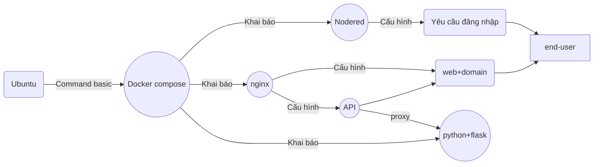

# Môn: Phát triển ứng dụng với mã nguồn mở-TEE0421

Lớp: 58KTPM

**Bài tập 01:**

## A. Đăng ký tên miền xịn cho cá nhân:
1. Đăng ký domain xịn (có thể dùng của [mắt bão](https://www.matbao.net/ten-mien/dang-ky-ten-mien.html), tên miền *.id.vn đang miễn phí cho mọi công dân việt nam <= 23 tuổi, *.io.vn : giá 30k vnđ/năm)
2. Đăng ký tài khoản [cloudflare](https://dash.cloudflare.com/)
3. Thêm domain đã đăng ký vào trong cloudflare : Nhận 2 dòng namespace
4. Nhập 2 dòng namespace của cloudflare vào trong trang quản lý DNS record của tên miền đăng ký (vd trên mắt bão)

## B. Cài đặt Ubuntu + Docker 
1. Cài đặt hệ điều hành Ubuntu 24.04.4 LTS
   -- Sử dụng một trong các công cụ để giả lập: HyperV (có sẵn của windows), VirutualBox (Miễn phí), VM_Ware (bản quyền)
   -- Download file [iso](https://releases.ubuntu.com/24.04.4/ubuntu-24.04.4-live-server-amd64.iso) để cài đặt.
   -- Cấu hình mạng trong Ubuntu (và công cụ giả lập) để cho phép truy cập SSH vào Ubuntu từ cmd của windows   
   >    **Ví dụ:**
   >
   >    - để ssh tới ubuntu ở ip 192.168.100.123, user là admin thì mở CMD trên windows, 
   >    - gõ lệnh: **ssh admin@192.168.100.123** 
   >    - hệ thống sẽ yêu cầu nhập password (chú ý : password sẽ không hiện ra)
   >    - sau khi login thành công sẽ thấy màn hình chào hỏi của ubuntu
2. Tìm hiểu các lệnh cơ bản của ubuntu
   > *Các lệnh cần tìm hiểu:*
   > 
   >    - Liệt kê các file trong thư mục: ls
   >    - Tạo thư mục: mkdir nameFolder
   >    - Chuyển thư mục làm việc: cd path
   >    - Copy file: cp file_nguồn path/file_đích
   >    - Thay đổi quyền thao tác file: sudo chmod  xxx filename
   >    - Edit file: sudo nano tenfile
   >       + CTRL+o : lưu nội dung sau khi edit
   >       + CTRL+x : thoát edit file
   >    - Xem ip của máy ubuntu: ip -4 addr
   > 
3. Cài đặt docker cho Ubuntu
4. Kiểm tra phiên bản docker vừa cài đặt, kiểm tra phiên bản của docker compose
5. Cấu hình để docker chạy mà không cần tiền tố sudo
6. Tìm hiểu tập lệnh của docker và docker compose

## C. Cấu hình docker compose:
1. Tạo thư mục: ~/myapp
2. Chuyển vào trong thư mục ~/myapp
3. Tạo thư mục: ./myweb
4. Tạo file ./myweb/index.html (với nội dung là thông tin cá nhân của em)
5. Tạo file **docker-compose.yml** để nó sẽ có các dịch vụ sau:
   > - Khai báo sử dụng nodered/node-red, cổng 1880, dữ liệu nằm tại thư mục ./nodered
   > - Khai báo sử dụng nginx, cổng 80, cấu hình trong file ./nginx/nginx.conf
   > - Mount thư mục ./myweb thành thư mục /myweb trong nginx
6. Edit file **./nginx/nginx.conf** để: 
   > - Cấu hình web server cổng 80
   > - server_name là sub-domain (sub-domain tuỳ ý của em)
   > - location / trỏ tới root là thư mục /myweb
   > - location /api dùng proxy_pass trỏ tới 1 (hoặc nhiều) node http_in của nodered
7. Edit file **./nodered/settings.js** để nodered bắt buộc đăng nhập

## D. Triển khai (level test) ứng dụng
1. Chuyển vào trong thư mục ~/myapp
2. Gõ lệnh để docker compose chạy: sẽ run tất cả các service khai báo trong file docker-compose.yml
3. Kiểm tra các container đang chạy trong docker, nếu có cái nào bị restart cần tìm lỗi rồi edit lại docker-compose.yml
4. Kiểm tra kiểm thử các service đang chạy độc lập thông qua ip và port của nó: ví dụ mở trình duyệt ip_ubuntu:1880 để check nodered đã chạy chưa
5. Sử dụng nodered: kéo nodered http_in , http_response, function : để tạo api get đơn giản (dùng cho /api proxy_pass của nginx)

## E. Triển khai ứng dụng đến End-user
1. Trong Cloudflare: Tạo tunnel (đường hầm), chọn loại triển khai cho docker
2. Convert lệnh docker run ... sang dạng docker compose
3. Khai báo kết quả convert vào trong file docker-compose.yml
4. Chạy lại docker compose
5. Public ứng dụng bằng cách thêm 1 router trỏ tới container đang chạy trong docker, dữ liệu sẽ đi qua tunnel, url dạng sub-domain
6. Kiểm tra url sub-domain đã hoạt động public cho mọi end-user

## Hướng dẫn làm bài:
1. sv tự làm trên laptop cá nhân, tự nâng cấp các phần mềm hoặc OS lên phiên bản phù hợp, trang bị cấu hình đủ tải (RAM từ 8GB, ổ cứng SSD or NVME)
2. quá trình làm: chụp màn hình, paste hình ảnh + gõ text chú thích cho hình ảnh vào readme.md của 1 repo trên github cá nhân, để truy cập public
3. làm xong các phần ABCDE: paste link của repo vào file tổng hợp excel online (làm sau cũng được, vì gihub ko fake date được)

